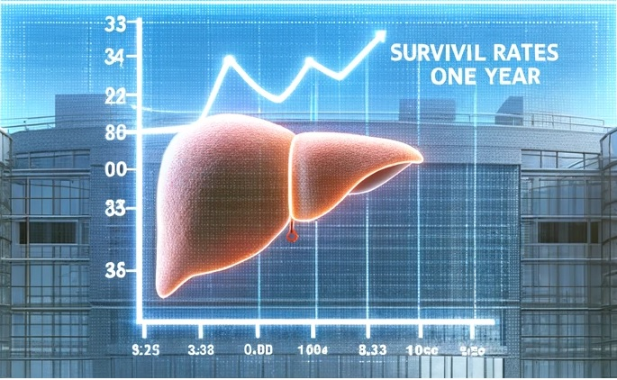

---
editor_options:
  markdown:
    wrap: 72
output:
  pdf_document: default
  html_document: default
---

#### Health Analytics

```{r echo=FALSE}


```

::: {style="text-align:justify;"}
#### Problema de Negócio

O objetivo deste projeto é tentar prever o tempo de sobrevivência de um
paciente um ano após o transplante de fígado. Usaremos dados reais
disponibilizados publicamente. Há normalmente uma grande fila de
pacientes esperando em um determinado momento para receber um
transplante de fígado, pois não há outra cura para o estágio final de
doença hepática. Nosso estudo visa ajudar os pacientes a compreender
melhor suas chances de sobrevivência após um ano do transplante. As
informações do nosso estudo mostram que somos capazes de prever o tempo
de sobrevivência com razoável precisão para diferentes intervalos de
tempo. Nosso modelo pode auxiliar os pacientes no processo de tomada de
decisão (como financeiro por exemplo), enquanto eles esperam na fila
para fazer um transplante.

Usando dados do Registro Científico de Recipientes de Transplante
(Scientic Registry of Transplant Recipients - SRTR), trabalharemos com
variáveis quantitativas e qualitativas criando modelos preditivos usando
o tempo de sobrevivência do paciente como nossa variável de resposta (ou
seja, teremos um problema de regressão, cujo objetivo é prever um valor
numérico).

Usaremos duas técnicas de regressão: regressão linear e rede neural.
Ambos os modelos previram o tempo de sobrevida do paciente por 1 a 3
anos após o transplante, usando um conjunto de variáveis mais
significativas. As variáveis foram escolhidas após uma pesquisa sobre
quais são os fatores mais importantes no processo de transplante de
fígado.

Nossos resultados nos dão a certeza de que podemos prever com razoável
precisão otempo de sobrevivência um ano após os pacientes receberem um
transplante de fígado. Acreditamos que isso dará aos pacientes uma ideia
melhor de suas mudanças de sobrevida por um período prolongado de tempo
após o transplante.

Usando as informações desses modelos, os pacientes podem tomar uma
decisão mais informada quando se trata de transplante de órgão com base
em sua condição médica.

Os dados foram extraídos do SRTR Database e modificados para que
pudessem ser executados com minha capacidade computacional.

Site oficial dos dados:
<https://www.srtr.org/about-the-data/the-srtr-database/>

Os dados originais devem ser solicitados no link abaixo e a aprovação
pode levar até 30 dias, sendo o objetivo estudo e pesquisa:
<https://www.srtr.org/requesting-srtr-data/data-requests/>

**MELD Score - Mayo End-Stage Liver Disease**

A pontuação MELD (MELD Score - Mayo End-Stage Liver Disease) é uma
métrica de quão doente um paciente está. Se você é um adulto com doença
hepática que pode exigir um transplante, sua pontuação MELD ajuda a
dizer com que rapidez você pode precisar dele. MELD significa "modelo
para doença hepática em estágio terminal". Os médicos usam um sistema
semelhante, chamado PELD (doença hepática em estágio terminal
pediátrico), para crianças menores de 12 anos. O MELD score é um número
que varia de 6 a 40, com base em testes de laboratório. Ele classifica o
grau de doença, que mostra o quanto você precisa de um transplante de
fígado. Quanto maior o número, mais urgente é o seu caso.

Referências:

<https://www.mdcalc.com/meld-score-model-end-stage-liver-disease-12-older>

<https://www.webmd.com/hepatitis/meld-score-for-liver-disease>

<https://optn.transplant.hrsa.gov/resources/allocation-calculators/meld-calculator/>

#### Dicionário de Dados

1.  **DAYSWAIT_CHRON**: Número de dias de espera crônicos, possivelmente
    referindo-se ao tempo que um paciente aguardou por um transplante.

2.  **PSTATUS**: Status pós-transplante do paciente, onde '0' indica sem
    complicações e '1' indica com complicações ou outro estado crítico.

3.  **FINAL_MELD_SCORE**: Pontuação MELD final (Model for End-Stage
    Liver Disease), usada para avaliar a gravidade da doença hepática
    crônica.

4.  **PTIME**: Tempo pós-transplante, possivelmente medido em dias.

5.  **TX_DATE**: Data do transplante.

6.  **PX_STAT**: Status do paciente, 'A' pode representar um estado
    específico.

7.  **PX_STAT_DATE**: Data da última atualização do status do paciente.

8.  **AGE**: Idade do paciente no momento do transplante.

9.  **ABO**: Tipo sanguíneo do paciente.

10. **GENDER**: Gênero do paciente, onde '1' pode representar masculino
    e '0' feminino.

11. **WGT_KG_TCR**: Peso do paciente na altura do cadastro para
    transplante, em quilogramas.

12. **HGT_CM_TCR**: Altura do paciente na altura do cadastro para
    transplante, em centímetros.

13. **BMI_TCR**: Índice de Massa Corporal (BMI) do paciente na altura do
    cadastro para transplante.

14. **DIAB**: Indica se o paciente tem diabetes, com diferentes valores
    representando diferentes estados ou tipos de diabetes.

15. **INIT_AGE**: Idade inicial do paciente quando do cadastro para
    transplante.

16. **ETHCAT**: Categoria étnica do paciente.

17. **REGION**: Região geográfica onde o transplante foi realizado.

18. **PERM_STATE**: Estado permanente de residência do paciente.

19. **TX_Year**: Ano em que o transplante foi realizado.

20. **TX_PROCEDUR_TY**: Tipo de procedimento de transplante realizado.

21. **MED_COND_TRR**: Condição médica do paciente no registro do
    transplante.

22. **PREV_TX**: Indica se o paciente já havia recebido um transplante
    anteriormente ('N' para não, 'Y' para sim).

23. **AGE_DON**: Idade do doador.

24. **GENDER_DON**: Gênero do doador.

25. **HGT_CM_DON_CALC**: Altura calculada do doador, em centímetros.

26. **WGT_KG_DON_CALC**: Peso calculado do doador, em quilogramas.

27. **BMI_DON_CALC**: Índice de Massa Corporal calculado do doador.

28. **COD_CAD_DON**: Código de causa de morte do doador.

29. **ETHCAT_DON**: Categoria étnica do doador.

30. **HOME_STATE_DON**: Estado de residência do doador.

31. **DIABETES_DON**: Indica se o doador tinha diabetes ('Y' para sim,
    'N' para não).

32. **HIST_HYPERTENS_DON**: Indica se o doador tinha histórico de
    hipertensão ('Y' para sim, 'N' para não).

33. **HIST_IV_DRUG_OLD_DON**: Indica histórico de uso de drogas
    intravenosas pelo doador.

34. **ABO_DON**: Tipo sanguíneo do doador.

35. **HIST_CANCER_DON**: Indica se o doador tinha histórico de câncer
    ('Y' para sim, 'N' para não).

36. **ALCOHOL_HEAVY_DON**: Indica se o doador consumia álcool de forma
    pesada ('Y' para sim, 'N' para não).

37. **ABO_MAT**: Compatibilidade do tipo sanguíneo ABO entre doador e
    receptor.

38. **COLD_ISCH**: Tempo de isquemia fria, o tempo que o órgão doado
    permanece preservado em baixas temperaturas durante o transporte até
    o transplante.

39. **MALIG**: Estado de malignidade, N-não, U-undefined, Y- yes .

40. **HGT_CM_CALC**: Altura calculada do paciente, em centímetros. Isso
    pode ser uma medida registrada ou uma estimativa usada em análises.

41. **WGT_KG_CALC**: Peso calculado do paciente, em quilogramas. Assim
    como a altura, pode ser uma medida atualizada ou uma estimativa.

42. **BMI_CALC**: Índice de Massa Corporal (BMI) calculado do paciente,
    uma medida de corporalidade baseada na altura e peso calculados.

43. **TX_MELD**: Indica se a pontuação MELD foi usada para o
    transplante. "No" sugere que não foi usado, talvez indicando outro
    critério ou método para avaliação da prioridade do transplante.

44. **LISTYR**: Ano em que o paciente foi listado para o transplante.

45. **LiverSize**: Tamanho do fígado do paciente, possivelmente medido
    em centímetros cúbicos ou outra unidade volumétrica, relevante para
    avaliar a compatibilidade do órgão para transplante.

46. **LiverSizeDon**: Tamanho do fígado do doador, similarmente medido
    para avaliações de compatibilidade do transplante.
:::

#### Bibliotecas

```{r message=FALSE, warning=FALSE, include=FALSE}
library(dplyr)
library(ggcorrplot)
library(forecast)# para calcular a métrica de acurácia
library(nnet) # função para tratamentos dos dados
library(neuralnet) # para criar um modelo de rede neural
library(ggplot2)
library(caret)
library(glmnet)
library(car)
```

#### Carregando os dados

```{r echo=TRUE, warning=FALSE}
dados <- read.csv("dados/dataset.csv", header =
TRUE, na.strings = c("")) 

dim(dados)
```

#### Análise Exploratória, Limpeza, Transformação e Manipulação de Dados

```{r echo=TRUE, warning=FALSE}
View(dados)
```

```{r}
# Tipos dos dados
str(dados)
```

#### Explorando os dados das variáveis numéricas

```{r echo=True}
# Idade do paciente

plot_gg <- ggplot(dados, aes(x=AGE)) +
  geom_density(fill="blue", alpha=0.5) +
  labs(title="Densidade de Idade", x="Idade", y="Densidade") +
  theme_minimal()

# Exibe o gráfico no RStudio
print(plot_gg)

# Salva o gráfico no arquivo usando ggsave
ggsave("densidade_idade_ggplot.png", plot = plot_gg, width=10, height=8, units="cm")
```

::: {style="text-align:justify;"}
Análises preliminares:

1.  **Forma da Distribuição**: A curva é unimodal, indicando uma única
    idade mais comum entre os pacientes que receberam transplantes. Não
    há evidências de múltiplos picos, o que sugeriria grupos distintos
    de idades.

2.  **Localização do Pico Central**: O pico da curva parece estar em
    torno dos 50-60 anos, indicando que essa é a idade mais comum dos
    pacientes no momento do transplante.

3.  **Assimetria**: O gráfico é ligeiramente assimétrico, com uma cauda
    mais longa se estendendo para as idades mais jovens e uma queda mais
    acentuada à medida que as idades aumentam após o pico. Isso pode
    sugerir que pacientes mais jovens são menos frequentemente
    submetidos a transplantes em comparação com aqueles na faixa etária
    de pico.

4.  **Amplitude de Idade**: O gráfico mostra que há uma ampla gama de
    idades entre os pacientes que recebem transplantes, desde jovens
    adultos até idosos. No entanto, a presença de pacientes muito jovens
    ou muito velhos parece ser menos comum.
:::

```{r echo=True}
# Idade do doador

plot_gg <- ggplot(dados, aes(x=AGE_DON)) +
  geom_density(fill="green", alpha=0.5) +
  labs(title="Densidade de Idade do Doador", x="Idade do Doador", y="Densidade") +
  theme_minimal()

# Exibe o gráfico no RStudio
print(plot_gg)

# Salva o gráfico no arquivo usando ggsave
ggsave("densidade_idade_doador.png", plot = plot_gg, width=10, height=8, units="cm")
```

::: {style="text-align:justify;"}
Análises preliminares:

1.  **Forma da Distribuição**: A distribuição é bimodal, o que significa
    que existem dois grupos de idades predominantes entre os doadores.
    Isso pode sugerir que existem dois perfis demográficos distintos
    entre os doadores.

2.  **Picos da Distribuição**: Há dois picos visíveis. O primeiro pico é
    em torno dos 20 anos, e o segundo, menor, está por volta dos 50
    anos. Isso pode indicar que a maioria dos doadores tende a ser mais
    jovem, com um segundo grupo significativo de meia-idade.

3.  **Variação de Idade**: O gráfico cobre uma gama de idades de 0 até
    aproximadamente 80 anos, mostrando que os doadores vêm de todas as
    faixas etárias, mas com menos frequência nos extremos da
    distribuição.

4.  **Assimetria**: A distribuição apresenta assimetria positiva (ou à
    direita), com uma cauda mais longa estendendo-se em direção a idades
    mais avançadas. Isso indica que, embora existam doadores mais
    velhos, eles são menos frequentes.

5.  **Interpretação Clínica**: A bimodalidade pode sugerir que há um
    grupo de doadores mais jovens, que talvez sejam doadores vivos ou
    tenham sofrido mortes prematuras, e um grupo de doadores mais
    velhos, que talvez sejam casos de morte natural ou condições
    crônicas. A presença de doadores mais jovens pode estar relacionada
    a causas de morte acidentais ou traumáticas.

6.  **Considerações para a Política de Doação**: Informações como essas
    podem ser importantes para desenvolver estratégias de educação e
    recrutamento de doadores, considerando as idades que mais
    frequentemente estão presentes na população doadora.
:::

```{r}
# Número de dias que a pessoa sobreviveu após um transplante
plot_gg <- ggplot(dados, aes(x=PTIME)) + geom_density(fill="red",
alpha=0.5) + labs(title="Número de dias que a pessoa sobreviveu após um
transplante", x="Dias", y="Densidade") + theme_minimal()

# Exibe o gráfico no RStudio
print(plot_gg)

# Salva o gráfico no arquivo usando ggsave
ggsave("numero_dias_apos_transpl.png", plot = plot_gg, width=10,
height=8, units="cm")
```

::: {style="text-align:justify;"}
Análises preliminares:

1.  **Pico Inicial Acentuado**: Existe um pico muito acentuado perto do
    zero. Isso sugere que uma quantidade relativamente grande de
    indivíduos não sobrevive muito tempo após o transplante.

2.  **Declínio Rápido**: Após o pico inicial, há uma queda rápida e
    constante na frequência conforme aumentam os dias de sobrevivência.
    Isso indica que menos pessoas sobrevivem por períodos mais longos
    após o transplante.

3.  **Cauda Longa**: A distribuição tem uma cauda longa que se estende
    para a direita, indicando que, embora em menor número, há indivíduos
    que sobrevivem por muitos dias após o transplante.

4.  **Possíveis Complicações Precoce**: A grande frequência de
    sobrevivência por um período curto pode refletir complicações
    pós-operatórias imediatas ou rejeição precoce do órgão
    transplantado.

5.  **Sobrevivência a Longo Prazo**: Mesmo com a frequência diminuindo,
    a presença de uma cauda longa indica que alguns pacientes conseguem
    uma sobrevivência a longo prazo.

6.  **Análise Quantitativa**: Seria importante calcular métricas como a
    mediana e a média de sobrevivência para entender melhor o tempo
    típico de sobrevivência. Outra análise relevante seria a sobrevida
    cumulativa ao longo do tempo.

7.  **Interpretação Clínica e Qualidade de Vida**: A análise detalhada
    dessa distribuição pode ajudar a entender e a melhorar os protocolos
    clínicos de acompanhamento e tratamento pós-transplante para
    aumentar a sobrevivência e a qualidade de vida dos pacientes.
:::

```{r}
# Número de dias que a pessoa espera para realizar um transplante

plot_gg <- ggplot(dados, aes(x=DAYSWAIT_CHRON)) + geom_density(fill="red",
alpha=0.5) + labs(title="Número de dias que a pessoa espera para realizar um transplante", x="Dias", y="Densidade") + theme_minimal()

# Exibe o gráfico no RStudio

print(plot_gg)

# Salva o gráfico no arquivo usando ggsave

ggsave("numero_dias_espera_transpl.png", plot = plot_gg, width=10,
height=8, units="cm")

```

::: {style="text-align:justify;"}
Análises Preliminares: 1. **Pico Próximo a Zero**: Existe um pico muito
proeminente perto de zero, o que sugere que uma grande proporção de
pacientes recebe um transplante logo após serem listados.

2.  **Declínio Acentuado**: O gráfico mostra um declínio acentuado na
    densidade conforme o número de dias aumenta, indicando que o número
    de pacientes que esperam por um período mais longo diminui
    rapidamente.

3.  **Cauda Longa**: A cauda longa da distribuição sugere que, embora
    raro, há pacientes que esperam um tempo muito longo para um
    transplante. Esta cauda se estende até aproximadamente 6000 dias.

4.  **Grande Maioria Espera Pouco Tempo**: A área sob a curva é mais
    concentrada perto do início do eixo dos dias, o que significa que a
    grande maioria dos pacientes espera relativamente pouco tempo.

5.  **Possíveis Melhorias no Sistema de Alocação**: Se o objetivo é
    minimizar o tempo de espera, o gráfico sugere que o sistema de
    alocação está funcionando bem para a maioria dos pacientes, mas
    ainda há espaço para melhorias para aqueles que acabam esperando
    mais tempo.

6.  **Considerações Adicionais**: Seria importante entender os fatores
    que contribuem para os tempos de espera mais longos para alguns
    pacientes. Isso pode incluir tipo de sangue, compatibilidade do
    órgão, gravidade da condição médica, ou outros critérios utilizados
    para alocar órgãos para transplante.
:::

```{r}
# Pontuação para severidade da doença hepática (MELD)
plot_gg <- ggplot(dados, aes(x=FINAL_MELD_SCORE)) + geom_density(fill="blue",
alpha=0.5) + labs(title="Pontuação para severidade da doença hepática (MELD)", x="Pontuação", y="Densidade") + theme_minimal()

# Exibe o gráfico no RStudio
print(plot_gg)

# Salva o gráfico no arquivo usando ggsave
ggsave("pontuação_MELD.png", plot = plot_gg, width=10,
height=8, units="cm")

```

#### Explorando as variáveis categóricas

```{r echo=TRUE}
library(skimr)

# Resumo rápido para EDA
skim(dados) 
```

-   A variável abaixo está um pouco confusa em relação aos seus dados.Se
    não tivermos certeza do tipo da variável descarte-a

```{r echo=TRUE}
dados$DIAB <- as.factor(dados$DIAB)
table(dados$DIAB)
```

-   A variável abaixo indica se a pessoa sobrevive ou não ao
    transplante.
-   0 indica a classe negativa e indica que a pessoa sobrevive.
-   1 indica a classe positiva indica que a pessoa não sobrevive.

```{r echo=TRUE}
dados$PSTATUS <- as.factor(dados$PSTATUS)
table(dados$PSTATUS)
```

-   Gênero do recebedor

```{R}
dados$GENDER <- as.factor(dados$GENDER)
table(dados$GENDER)
```

-   Gênero do doador

```{r}

dados$GENDER_DON <- as.factor(dados$GENDER_DON)
table(dados$GENDER_DON)
```

-   Fonte de dados da região de onde foram coletados os dados.

```{r echo=FALSE}
dados$REGION <- as.factor(dados$REGION)
table(dados$REGION)
```

-   A variável abaixo indica o ano em que os dados foram registrados.
-   Os anos de 2001 e 2002 apresentam valores bem pequenos em relação
    aos demais.
-   A decisão será , mais adiante, não utilizar os registros deste anos.

```{r}
dados$TX_Year <- as.factor(dados$TX_Year)
table(dados$TX_Year)

```

-   A variável abaixo indica se havia ou não algum tipo de tumor no
    recebedor.
-   N-não, U-undefined, Y- yes

```{r}
dados$MALIG <- as.factor(dados$MALIG)
table(dados$MALIG)
```

-   histórico de cancer do doador
-   N-não, U-undefined, Y- yes

```{r}
dados$HIST_CANCER_DON <- as.factor(dados$HIST_CANCER_DON)
table(dados$HIST_CANCER_DON)
```

-   Considerando apenas os pacientes que sobreviveram ao primeiro ano de
    cirurgia,pois queremos prever o tempo de sobrevivência após um ano
    de transplante

```{r}
dados1 <- dados %>%
  filter(PTIME > 365) %>%
  mutate(PTIME = (PTIME - 365))

dim(dados1)
```

-   Dos pacientes que sobreviveram ao primeiro ano da cirurgia,
    filtramos os que permaneceram vivos por até três anos depois da
    cirurgia.

```{r}
dados2 <- dados1 %>%
  filter(PTIME <= 1095)

dim(dados2)
View(dados2)
str(dados2)
```

Retirando valores NA

```{r}
dim(dados2)
sum(is.na(dados2))
```

Transformando variáveis categóricas em fator:

```{r}
# Selecionar variáveis do tipo character e transformá-las em factor
dados3 <- dados2 %>%
  mutate(across(where(is.character), as.factor))
summary(dados3)
```

Retirando algumas variáveis que não farão parte da análise.
HIST_IV_DRUG_OLD_DON possui quase a totalidade de valores NA

```{r}
dados3 <- subset(dados3, select = -c(PX_STAT_DATE, TX_MELD, TX_DATE, HIST_IV_DRUG_OLD_DON))
```

Verifcando valores NA

```{r}
sum(is.na.data.frame(dados3))

```

Retirando valores NA

```{r}
dados3_sem_na <- na.omit(dados3)

dim(dados3_sem_na)
```

Separando variáveis numéricas de categóricas

```{r}
dados_num <- dados3_sem_na %>%
  select_if(~!is.factor(.))

dados_fator <- dados3_sem_na %>%
  select_if(~is.factor(.))


dim(dados_num)
dim(dados_fator)

str(dados_num)
str(dados_fator)

View(dados_num)
View(dados_fator)
```

Nota: Para evitar a "armadilha dummy", que é um problema de
multicolinearidade perfeita resultante da inclusão de uma variável dummy
para cada nível de uma variável categórica, é essencial deixar de fora
uma das categorias dummy de cada variável categórica. A categoria que
você deixa de fora atua como a categoria de referência ou base, e os
coeficientes das outras categorias dummy são interpretados em relação a
essa categoria base.

```{r}
# Convertendo variáveis categóricas em dummies. O modelo não inclui o intercepto (-1), então uma categoria é automaticamente excluída.
dados_fator_dummies <- model.matrix(~ . - 1, data = dados_fator)

# Combinando os dados numéricos e os dummies das variáveis categóricas. glmnet faz a padronização automaticamente
dados_combinados <- cbind(dados_num, dados_fator_dummies)

#Variável alvo na primeira posição
dados_combinados <- dados_combinados %>%
  select(PTIME, everything())

#padronizando variáveis numéricas execto variável alvo
dados_combinados[, 2:25] <-scale(dados_combinados[, 2:25])
dim(dados_combinados)
View(dados_combinados)
```

**Verificando a multcolinearidade por meio do cálculo do VIF**

O VIF(Fator de inflação de Variância) mede o quanto a variância de um
coeficiente estimado é aumentada devido à multicolinearidade. Valores de
VIF maiores que 5 ou 10 (dependendo da fonte literária ou da tolerância
específica do seu projeto) indicam um nível problemático de
multicolinearidade.

```{r}
# ajusta o modelo para VIF
model_vif <- lm(PTIME ~., data = dados_combinados)
summary(model_vif)

```

O modelo model_vif apresentou uma relação linear perfeita em 4
variáveis. Temos que remover manualmente para não ocorrer o erro:Error
in vif.default(model_vif) : there are aliased coefficients in the model

```{r}
# Retirando variáveis
dados_combinados2 <- subset(dados_combinados, select = -c(LiverSize, LiverSizeDon, PSTATUS1, TX_Year2018))
model_vif2 <- lm(PTIME ~ ., data = dados_combinados2 )

# Calcular VIF
vif_values <- car::vif(model_vif2)
str(vif_values)
print(vif_values)
```

```{r}
# Suponha que 'high_vif_names' contém os nomes das variáveis com VIF > 5
high_vif_names <- names(vif_values)[which(vif_values > 5)]

# Remover estas variáveis do dataframe 'dados_combinados'
dados_combinados_reduzido <- dados_combinados2[, !(names(dados_combinados2) %in% high_vif_names)]

# Verificar a estrutura do novo dataframe para confirmar a remoção
str(dados_combinados_reduzido)
View(dados_combinados_reduzido)
```

**Correlação entre as variáveis**

```{r}
df_corr <- round(cor(dados_combinados_reduzido, use = "complete.obs"), 2)

corr_plot <- ggcorrplot(df_corr, tl.cex = 6) 

print(corr_plot)

ggsave("Health_analytics/corr_plot.png", corr_plot, width = 10, height = 8)

```

#### Modelagem Preditiva com Modelo de Regressão Linear

Vamos trabalhar apenas com as variáveis mais significativas para o
problema por meio da interpretação do p-valor.

```{r}
modelo_lm <- lm(PTIME ~ .,data = dados_combinados_reduzido)

# Obter o resumo do modelo
summary(modelo_lm)
```

Extração das varíáveis mais significativas do modelo

```{r}
# Extrair p-valores
p_values <- coef(summary(modelo_lm))[, "Pr(>|t|)"]

# Filtrar variáveis com p-valor < 0.05
var_significativas <- names(p_values)[p_values < 0.05]
var_significativas <- setdiff(var_significativas, "(Intercept)")
var_significativas <- c("PTIME", var_significativas)
print(var_significativas)

```

Divisão dos dados em treino e teste

```{r}
dados_final <- dados_combinados_reduzido[, var_significativas]
View(dados_final)

# Divisão dos dados em treino e teste
set.seed(1)
index <- sample(1:nrow(dados_final), dim(dados_final)[1]*.7)
dados_treino <- dados_final[index,]
dados_teste <- dados_final[-index,]

View(dados_treino )
View(dados_teste)
```

**Treinando o primeiro modelo**

```{r}
# Instalando e carregando o pacote necessário para RMSE e MAE
if (!require(Metrics)) {
    install.packages("Metrics")
    library(Metrics)
}

# Treinando o modelo
modelo_v1 <- lm(PTIME ~ ., data = dados_treino)

# Fazendo previsões com dados de treino
modelo_v1_pred_1 <- predict(modelo_v1, newdata = dados_treino)

# Calculando RMSE para dados de treino
rmse_treino <- rmse(dados_treino$PTIME, modelo_v1_pred_1)
print(paste("RMSE Treino:", rmse_treino))

# Fazendo previsões com dados de teste
modelo_v1_pred_2 <- predict(modelo_v1, newdata = dados_teste)

# Calculando RMSE para dados de teste
rmse_teste <- rmse(dados_teste$PTIME, modelo_v1_pred_2)
print(paste("RMSE Teste:", rmse_teste))
```

Plot dos Resíduos

```{r}
# Adicionando os resíduos ao dataframe
dados_teste$residuos <- dados_teste$PTIME - modelo_v1_pred_2

# Carregando o pacote ggplot2
library(ggplot2)

# Criando o histograma de resíduos
plot_gg <- ggplot(dados_teste, aes(x=residuos)) +
  geom_histogram(fill="blue", alpha=0.5, bins=30) +  # Definindo o número de bins
  labs(title="Distribuição de Resíduos - Modelo_v1", x="Resíduos", y="Frequência") +
  theme_minimal()

# Exibe o gráfico no RStudio
print(plot_gg)

# Salva o gráfico no arquivo usando ggsave
ggsave("Distribuição de Resíduos Modelo_v1.png", plot = plot_gg, width=10, height=8, units="cm")

```

::: {style="text-align:justify;"}
-   Centralização: Os resíduos parecem estar centrados em torno de zero,
    o que é um bom sinal. Um modelo bem ajustado terá seus resíduos
    distribuídos de forma simétrica ao redor do zero.
-   Forma da Distribuição: A distribuição dos resíduos não parece ser
    perfeitamente normal. Há várias modas visíveis (picos na
    distribuição), sugerindo que a distribuição dos resíduos é
    multimodal.
-   Variância dos Resíduos: Há uma variação considerável nos resíduos,
    com alguns deles estendendo-se para além de -500 e 500. Isso pode
    indicar que o modelo tem dificuldade em capturar todos os padrões
    nos dados, resultando em previsões que, em alguns casos, estão
    bastante distantes dos valores reais.
-   Homoscedasticidade: Idealmente, queremos que os resíduos sejam
    homoscedásticos, o que significa que os resíduos têm variâncias
    constantes em toda a gama de previsões. No entanto, sem uma
    visualização de um gráfico de dispersão dos resíduos contra os
    valores previstos, não podemos avaliar completamente a
    homoscedasticidade. Se os resíduos mostrarem padrões claros ou se
    expandirem (em forma de funil, por exemplo) à medida que os valores
    ajustados aumentam ou diminuem, isso indicaria heteroscedasticidade.
-   Outliers: A presença de resíduos com valores altos (tanto positivos
    quanto negativos) pode indicar outliers no dataset ou que o modelo
    não está lidando bem com todas as nuances dos dados.
:::

**Treinando o segundo modelo**

Usando regularização LASSO para seleção de variáveis

```{r}

# Separando a variável alvo das preditoras
X <- as.matrix(subset(dados_combinados, select = -PTIME))

# Garanta que 'y' não seja padronizado junto com as variáveis preditoras
Y <- dados_num$PTIME 

# Para reprodutibilidade
set.seed(123) 

# Ajuste do modelo LASSO usando validação cruzada. Alpha = 1 indica LASSO
cv_model <- cv.glmnet(X, Y, alpha = 1)

```

**Nota**: Sobre o uso de glmnet, o objeto x usado em glmnet deve ser uma
matriz e y um vetor. Trabalhando com um dataframe em R, deve-se
converter apropriadamente o dataframe para matriz antes de aplicar
glmnet.

Extraindo os coeficientes e verificando as variáveis selecionadas

```{r}
# Verifique se o cv_model possui os componentes esperados
print(cv_model$lambda.min)  # Deve retornar o valor de lambda que minimiza o MSE
print(cv_model$lambda.1se)  # Deve retornar o valor de lambda dentro de um SE do mínimo

# Extraia os coeficientes para lambda.min e lambda.1se
coeficientes_min <- coef(cv_model, s = "lambda.min")
coeficientes_1se <- coef(cv_model, s = "lambda.1se")

# Verifique se os coeficientes são NULL
print(coeficientes_min)
print(coeficientes_1se)

```

Utilizaremos lambda_1se para treinar o modelo, que é o valor de lambda
mais simples (maior) que está dentro de um desvio padrão do erro mínimo.
Este lambda geralmente leva a modelos mais simples e potencialmente mais
robustos.

```{r}
lambda_1se <- cv_model$lambda.1se

# Usar esse lambda para treinar o modelo
model1 <- glmnet(X, Y, alpha = 1, lambda = lambda_1se)
```

Previsões do modelo

```{r}
predicted_values <- predict(model1, X, s = lambda_1se)
residuals <- Y - predicted_values
plot(residuals)
```

Medidas de Ajuste e Performance

```{r}

rmse_model1 <- rmse(Y, predicted_values)
print(paste("RMSE model1:", rmse_model1))

```

**Treinando o terceiro modelo**

```{r}
# Carregar a biblioteca necessária
library(caret)

# Para reprodutibilidade
set.seed(123)  

# Criar índices para a divisão
trainIndex <- createDataPartition(dados_combinados$PTIME, p = 0.8, list = FALSE)

# Dividir os dados em treino e teste
trainData <- dados_combinados[trainIndex, ]
testData <- dados_combinados[-trainIndex, ]
```

Ajustar o modelo LASSO no conjunto de treino

```{r}

x_train <- model.matrix(~ . -1, data = trainData[, -which(names(trainData) == "PTIME")])
y_train <- trainData$PTIME

cv_model <- cv.glmnet(x_train, y_train, alpha = 1)

# Avaliar o modelo no conjunto de teste
x_test <- model.matrix(~ . -1, data = testData[, -which(names(testData) == "PTIME")])
y_test <- testData$PTIME

predictions <- predict(cv_model, s = "lambda.1se", newx = x_test)
rmse_test <- sqrt(mean((predictions - y_test)^2))
print(rmse_test)
```

**Treinando o quarto modelo**

Dividindo em em dados de treino

```{r}
#padronizando a variável alvo
dados_final[['PTIME']]<-scale(dados_final[['PTIME']], center =TRUE, scale = TRUE)[,1]
View(dados_final)
```

```{r}
index2 <- sample(1:nrow(dados_final), dim(dados_final)[1]*.70)
dados_treino2 <- dados_final[index2,]
dados_teste2 <- dados_final[-index2,]
View(dados_treino2)
View(dados_teste2)

```

Treinando a Rede neural

```{r}
# Colocando em um dataframe
dados_treino2 <- data.frame(model.matrix(~ . - 1, data = dados_treino2))
dados_teste2 <- data.frame(model.matrix(~ . - 1, data = dados_teste2))

modelo_v2 <- neuralnet::neuralnet(PTIME ~ ., 
                                  data = dados_treino2, 
                                  linear.output = TRUE,
                                  hidden = 2,
                                  stepmax = 1e7)

```

Plotagem do modelo

```{r}
# Plot
plot(modelo_v2,
     col.entry.synapse = "red", 
     col.entry = "brown",
     col.hidden = "green", 
     col.hidden.synapse = "black",
     col.out = "yellow", 
     col.out.synapse = "purple",
     col.intercept = "green", 
     fontsize = 10,
     show.weights = TRUE ,
     rep = "best")
```

Avaliação do modelo

```{r}
# Avaliação do modelo

# Avaliação do modelo com dados de treino
modelo_v2_pred_1 <- compute(modelo_v2, dados_treino2)
rmse_treino <- rmse(dados_treino2$PTIME, modelo_v2_pred_1$net.result)

# Avaliação do modelo com dados de teste
modelo_v2_pred_2 <- compute(modelo_v2, dados_teste2)
rmse_teste <- rmse(dados_teste2$PTIME, modelo_v2_pred_2$net.result)

# Exibe os RMSE
print(paste("RMSE Treino:", rmse_treino))
print(paste("RMSE Teste:", rmse_teste))
```

Avaliação na unidade original de PTIME

```{r}

dados_final2 <- dados_combinados_reduzido[, var_significativas]
View(dados_final2)

# Calculando a média de PTIME
media_ptime <- mean(dados_final2$PTIME)
sd_ptime <- sd(dados_final2$PTIME)

#Conversão dos valores

prev_treino_originais <- (modelo_v2_pred_1$net.result * sd_ptime) + media_ptime
prev_teste_originais<- (modelo_v2_pred_2$net.result * sd_ptime) + media_ptime

# Calculando RMSE com valores na escala original para dados de treino e teste


rmse_treino_original <- rmse((dados_treino2$PTIME * sd_ptime) + media_ptime, prev_treino_originais)
rmse_teste_original <- rmse((dados_teste2$PTIME * sd_ptime) + media_ptime, prev_teste_originais)

# Exibe os RMSE na unidade original
print(paste("RMSE Treino Original:", rmse_treino_original))
print(paste("RMSE Teste Original:", rmse_teste_original))
```

Conclusão: O TERCEIRO modelo de regressão linear apresentou uma taxa de
erro menor e, portanto, deve ser usado como versão final.

Sim, conseguimos prever o tempo de sobrevivência dos pacientes 1 ano
após receberem um transplante.

**Fim**
